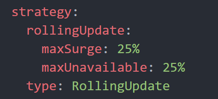
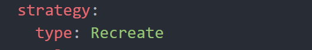
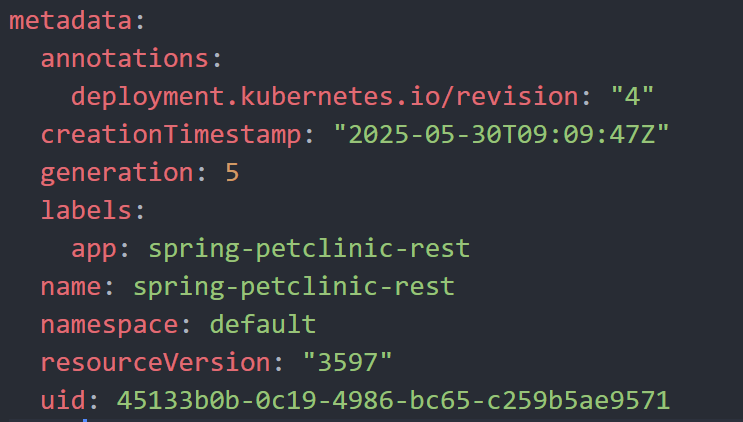
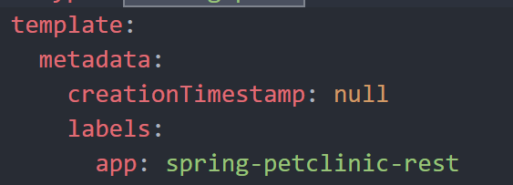
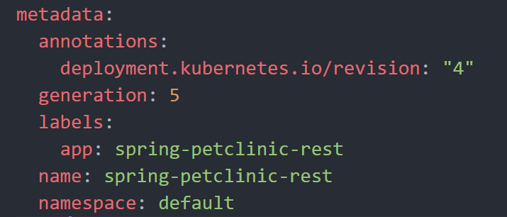
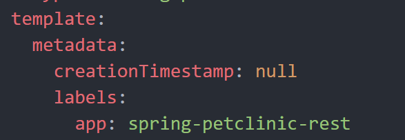
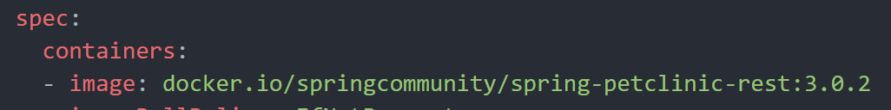
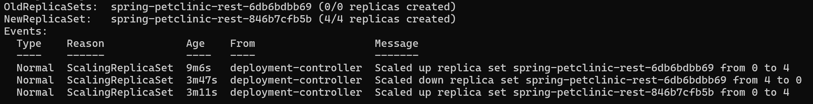

# Tutorial-11

## Reflection

### Reflection on Hello Minikube

1. Initially, when the pod was just running internally, the logs would only show the startup messages indicating that the HTTP server started on port 8080 and UDP server on port 8081. However, after exposing it as a Service and accessing it through the browser, the logs will show additional entries each time I accesses the application. Every HTTP request made to the application generates new log entries showing the incoming requests.

2. The -n option specifies which Kubernetes namespace to query for resources. In the first kubectl get commands without the -n option, kubectl defaults to the "default" namespace, which is where user-created resources like the hello-node deployment and service are placed unless explicitly specified otherwise. When using -n kube-system, the command specifically targets the "kube-system" namespace, which is a special namespace reserved for Kubernetes system components and infrastructure pods. This is why the output doesn't show the hello-node pod and service that were explicitly create. They exist in the default namespace, not in kube-system.

### Reflection on Rolling Update & Kubernetes Manifest File

1. The difference between the Rolling Update and Recreate deployment strategies lies in how application updates are applied with respect to downtime and availability. Rolling Update incrementally replaces old Pods with new ones, ensuring that some instances of the application are always running during the update process, while Recreate strategy first terminates all existing Pods before creating new ones, causing temporary downtime since no application instances are running during the transition period.

2. 
First, I change the strategy in the deployment.yaml file to recreate, then apply the deployment file.

Before:

After:

Next, I remove automatically generated metadata such as creationTimestamp, resourceVersion, selfLink, and uid, which should not be present in declarative configuration files.

Before:

After:

I also change the application version from 3.2.1 back to 3.0.2 to observe the deployment action.

Apply the changes using the `kubectl apply -f deployment.yaml` command. The existing pods will be deleted and new pods will be created with the latest version of the application.

The recreate strategy removes all old pods and creates 4 new pods with the latest version of the application.

3. It's in `deployment-recreate.yaml`.

4. Deploying resources by running separate commands for each component felt slow. With manifest files, I can define the entire configuration and desired state of my app, including deployments, services, and networking rules in YAML file. This makes it much easier to keep track of what’s deployed and replicate environments. Applying changes becomes as simple as updating the manifest and running `kubectl apply -f`.